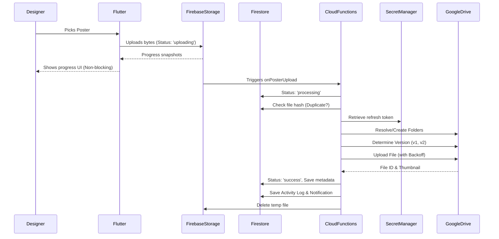

# Enterprise Google Drive Integration Architecture

## Overview

The integration has been upgraded to a clean, modular, and secure backend-driven architecture. The Flutter client delegates all OAuth token management and file transfers to Firebase Cloud Functions and Firestore.

## Components

### 1. Flutter Client
- **`GoogleAuthService`**: Triggers OAuth flow by calling Cloud Functions.
- **`UploadService`**: Handles background file uploads to Firebase Storage (`temp_posters/`). Sends customized metadata (assignmentId, clientName, etc.) to trigger the backend pipeline.
- **`UploadPosterScreen`**: Subscribes to the Firestore `assignments` document to render real-time UI states (Pending → Uploading → Processing → Success → Failed) without blocking the user.

### 2. Firebase Cloud Functions
- **`auth.js`** (`generateAuthUrl`, `exchangeAuthCode`): Handles OAuth authentication and stores the refresh token directly into **Google Secret Manager**.
- **`upload.js`** (`onPosterUpload`): Storage trigger that orchestrates the backend pipeline:
  - **DuplicateDetectionService**: Verifies SHA-256 file hashes to prevent redundant uploads.
  - **FolderService**: Recursively creates and caches `Festival Posters / [Year] / [Festival] / [Client]`.
  - **FileVersionService**: Iterates existing files to safely generate `[YYYY]_[Festival]_[Client]_v[X].ext`.
  - **GoogleDriveService**: Manages the API upload with exponential backoff retries and public permission provisioning.
  - **ThumbnailService**: Extracts optimized thumbnail URLs.
  - **ActivityLogService**: Writes an audit log entry for every successful pipeline execution.
  - **NotificationService**: Generates role-based status alerts in Firestore.

### 3. Data Storage
- **Google Secret Manager**: Stores `drive_refresh_token`.
- **Firebase Storage**: Temporary staging bucket for files (deleted automatically after processing).
- **Firestore**:
  - `assignments`: Non-sensitive file metadata (File ID, Share URL, Mime Type, Hash, Version).
  - `settings/drive_integration`: Status of connection (no credentials).
  - `activity_logs`: Audit trail.
  - `notifications`: Status alerts.

## Sequence Flow

